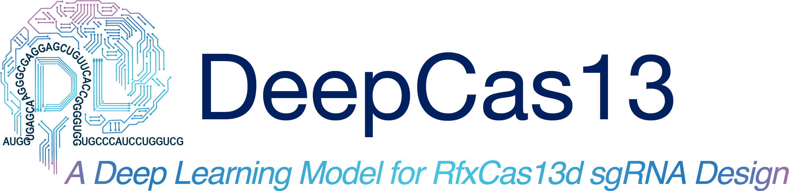
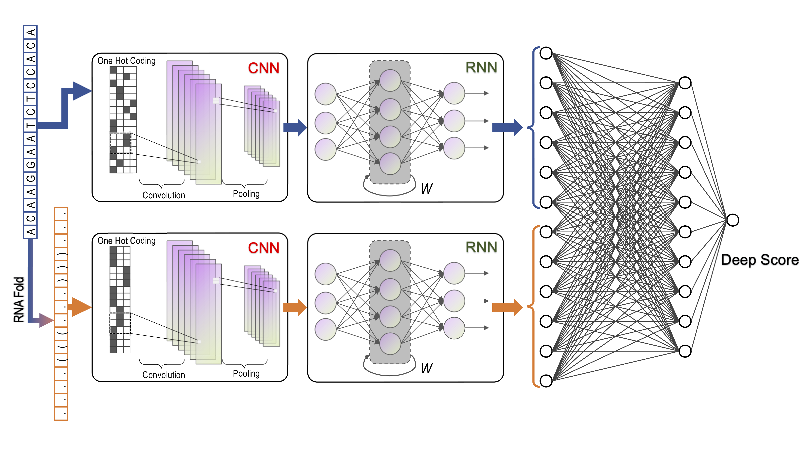

**DeepCas13**, A deep learning model to predict the CRISPR-Cas13d sgRNA on-target activity with high accuracy from sgRNA sequences and RNA secondary structures.

DeepCas13 uses convolutional recurrent neural network (CRNN) to extract spatial-temporal features for both sequence and secondary structure of a specific sgRNA and then predicts the efficiency by a fully connected neural network (FCNN).



We also provide a [webserver](http://deepcas13.weililab.org/) for user to design Cas13d sgRNAs online.

## How to run this source code ##

### Install dependencies ###

1. Create a conda environment

```
	conda create --name deepcas13 python=3.6
```
	
2. Activate the environment

```
	conda activate deepcas13
```

3. Install the dependencies

```
    conda install pandas numpy=1.19.1 seaborn scikit-learn 
	
	conda install -c conda-forge jupyterlab
	
    conda install -c bioconda viennarna
	
	conda install -c conda-forge tensorflow=2.4
	
	
```

4. Check the usage

```
    python deepcas13.py -h
	
	
```

### Run the demo ###

Here, we provie 3 demos to show how to use DeepCas13, including train model, predict sgRNA efficiency and design sgRNAs for target sequence.

#### Demo 1. Train DeepCas13 model ####

```
	python deepcas13.py --train --savepath DL_model --data data/training_data.csv
```

#### Demo 2. Predict sgRNA efficiency ####

```
	python deepcas13.py --seq data/test_data_sgrna1.csv --model DL_model
```

#### Demo 3. Design sgRNAs for target sequence ####

```
	python deepcas13.py --seq data/test_data_target.fa --model DL_model --type target
```

### About the output ###

The output of DeepCas13 is a csv file: 

|sgrna|seq|deepscore|
|--------|----------|------------|
|sgRNA_0_22|TTCCCTACTTCCTGTGCTCTTG| 0.44 |
|sgRNA_1_23|TCCCTACTTCCTGTGCTCTTGC| 0.61 |
|sgRNA_2_24|CCCTACTTCCTGTGCTCTTGCG| 0.61 |
|sgRNA_3_25|CCTACTTCCTGTGCTCTTGCGG| 0.64 |


### Authors ###

* Xiaolong Cheng: xcheng@childrensnational.org
* Wei Li: wli2@childrensnational.org

### License ###

Licensed under the [MIT license](http://opensource.org/licenses/MIT). This project may not be copied, modified, or distributed except according to those terms.